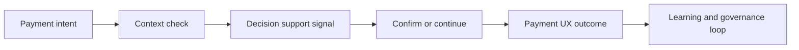

  

  

  
  
  

# UPI Cognitive Spend Brake

**Responsible payment decision support for selected digital UPI moments.**

This repository is a public concept showcase. It explains the product thesis, payment-UX model, responsible AI posture and investor-facing roadmap. It does not expose proprietary source code, scoring logic, prompts, datasets, credentials, payment simulation internals or production integrations.

---

## Why this matters

Instant payment systems create speed and convenience. Some digital payment moments still need better context, clearer confirmation and transparent user control.

## Product thesis

UPI Cognitive Spend Brake is a context-aware decision-support layer for UPI-style payments. It evaluates selected payment contexts and helps create a cleaner user experience through transparent nudges, confirmation flows and audit-ready decision logs.

---

## Concept flow

## Capability map

| Layer | Capability | Value |
|---|---|---|
| Market | UPI payment UX intelligence | Improves trust and clarity |
| Product | Context-aware confirmation flow | Supports better user decisions |
| AI/ML | Pattern and context support | Improves timing of nudges |
| Platform | API/SDK integration model | Fits payment and fintech apps |
| Governance | Transparent logs and user control | Supports responsible AI posture |

---

## What is intentionally not public

- Source code
- Payment logic
- Risk rules
- Prompts or model details
- Datasets or credentials
- Production deployment details

## Success metrics

| Metric | Why it matters |
|---|---|
| Confirmation completion rate | UX fit |
| User override behaviour | Product calibration |
| Repeat intervention quality | AI value |
| Audit log completeness | Governance readiness |

## Positioning

UPI Cognitive Spend Brake sits at the intersection of UPI, digital payment UX, responsible AI and context-aware payment decision support.

**Owner:** [Prashant Jagtap](https://github.com/jprbom)  
**Repository type:** Public showcase, proprietary concept
