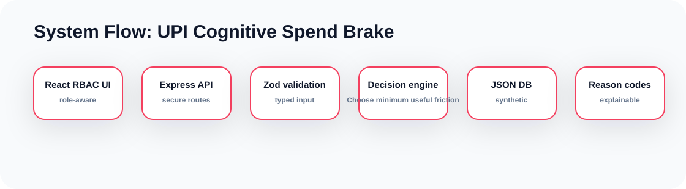

# UPI Cognitive Spend Brake Rich Diagrams

  

  

## Decision Journey

~~~mermaid
flowchart TD
  A["UPI intent"]:::start --> B["Budget memory"]:::signal
  B --> C["Impulse score"]:::model
  C --> D["Friction policy"]:::decision
  D --> E["Neutral nudge"]:::output
  E --> F["Audit trail + dashboard update"]:::audit

  classDef start fill:#ecfeff,stroke:#10b981,stroke-width:2px,color:#083344
  classDef signal fill:#fef3c7,stroke:#f59e0b,stroke-width:2px,color:#422006
  classDef model fill:#eef2ff,stroke:#10b981,stroke-width:2px,color:#1e1b4b
  classDef decision fill:#fff7ed,stroke:#f43f5e,stroke-width:2px,color:#431407
  classDef output fill:#dcfce7,stroke:#16a34a,stroke-width:2px,color:#052e16
  classDef audit fill:#f8fafc,stroke:#64748b,stroke-width:2px,color:#0f172a
~~~

## Data Flow Diagram

~~~mermaid
flowchart LR
  User["Role-aware user"]:::user --> UI["React dashboard"]:::ui
  UI --> API["Express API"]:::api
  API --> Guard{"RBAC allowed?"}:::guard
  Guard -- "No" --> Deny["403 RBAC_DENIED"]:::deny
  Guard -- "Yes" --> Validate["Zod schema validation"]:::guard
  Validate --> Store[("Payment Intent Simulator / Spend Brake Rules")]:::data
  Validate --> Engine["Choose minimum useful friction"]:::model
  Store --> Response["Dashboard JSON"]:::output
  Engine --> Explain["Reason codes + narrative"]:::model
  Explain --> Response

  classDef user fill:#f8fafc,stroke:#475569,color:#0f172a
  classDef ui fill:#ecfeff,stroke:#10b981,stroke-width:2px,color:#083344
  classDef api fill:#fff7ed,stroke:#f43f5e,stroke-width:2px,color:#431407
  classDef guard fill:#fef3c7,stroke:#f59e0b,stroke-width:2px,color:#422006
  classDef deny fill:#fee2e2,stroke:#dc2626,stroke-width:2px,color:#450a0a
  classDef data fill:#dcfce7,stroke:#16a34a,stroke-width:2px,color:#052e16
  classDef model fill:#eef2ff,stroke:#10b981,stroke-width:2px,color:#1e1b4b
  classDef output fill:#f0fdf4,stroke:#f59e0b,stroke-width:2px,color:#052e16
~~~

## API Flow

~~~mermaid
sequenceDiagram
  participant User as Dashboard User
  participant UI as React UI
  participant API as Express API
  participant RBAC as RBAC Gate
  participant DB as JSON DB
  participant Engine as Decision Engine
  User->>UI: Select role and run workflow
  UI->>API: Request with x-user-role
  API->>RBAC: Check read/write/admin permission
  RBAC-->>API: Allow or deny
  API->>DB: CRUD synthetic records
  API->>Engine: Compute Choose minimum useful friction
  Engine-->>API: Decision + reason codes
  API-->>UI: Render updated command center
~~~

## Deployment View

~~~mermaid
flowchart TB
  Repo["Private GitHub repo"]:::repo --> CI["npm run verify"]:::ci
  CI --> Build["Backend dist + Frontend dist"]:::ci
  Build --> Runtime["Node 22 runtime"]:::runtime
  Runtime --> Backend["Express API :4106"]:::runtime
  Runtime --> Frontend["Vite preview :5106"]:::runtime
  Backend --> DB[("Mounted synthetic JSON DB")]:::data

  classDef repo fill:#ede9fe,stroke:#7c3aed,stroke-width:2px,color:#2e1065
  classDef ci fill:#fef3c7,stroke:#d97706,stroke-width:2px,color:#422006
  classDef runtime fill:#dbeafe,stroke:#2563eb,stroke-width:2px,color:#1e3a8a
  classDef data fill:#dcfce7,stroke:#16a34a,stroke-width:2px,color:#052e16
~~~

