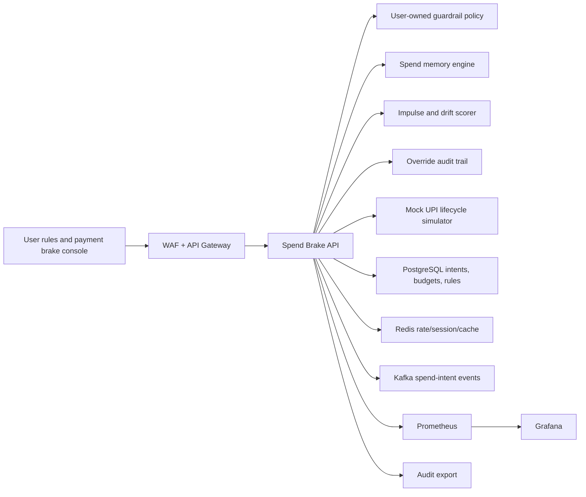
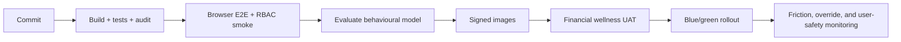

# Enterprise Cloud Deployment

Author: Prashant Jagtap <jprbom@gmail.com>

This repository is a runnable portfolio MVP today. The enterprise target is a user-controlled responsible-spending guardrail for UPI and UPI Lite. It evaluates simulated payment intents against user-owned budgets, category rules, cooling-off preferences, and essential-spend exemptions.

## Reference Architecture



## Cloud Mapping

| Layer | AWS | Azure | GCP |
| --- | --- | --- | --- |
| Runtime | EKS/ECS/Fargate | AKS/Container Apps | GKE/Cloud Run |
| Database | RDS PostgreSQL | Azure PostgreSQL | Cloud SQL |
| Cache | ElastiCache Redis | Azure Cache for Redis | Memorystore |
| Events | MSK/SQS | Event Hubs/Service Bus | Pub/Sub |
| Secrets | Secrets Manager/KMS | Key Vault | Secret Manager/KMS |
| Observability | CloudWatch/Grafana | Azure Monitor/Grafana | Cloud Monitoring |

## Production Spend Brake Differentiators

- User-owned category, time, amount, and cooling-period guardrails.
- Override flow with reason capture and audit trail.
- Essential-spend exemption for medicine, rent, transport, and other protected categories.
- UPI Lite micro-spend leakage simulator.
- Privacy-first option where rules can run locally or with minimal server-side retention.

## Required Variables

```text
NODE_ENV=production
PORT=4106
CORS_ORIGIN=https://spend-brake.example.com
DATABASE_URL=postgresql://...
REDIS_URL=redis://...
KAFKA_BROKERS=broker-1:9092
OIDC_ISSUER=https://issuer.example.com
OIDC_AUDIENCE=upi-spend-brake-api
```

## Security and User Autonomy

The current app is a demo simulator. Enterprise deployment must enforce OIDC/JWT, tenant/user isolation, encrypted budget data, immutable override audit logs, explicit opt-in, revocation, and policies that never silently block essential categories.

## Data Model Target

```text
tenants, users, roles, permissions
payment_intents, budget_categories, user_guardrails
self_control_rules, spend_memory_snapshots
brake_decisions, override_events, essential_exemptions
decision_reason_codes, model_versions, audit_logs
```

## Deployment Flow



## Observability

Operational endpoints:

- `GET /api/live`
- `GET /api/ready`
- `GET /api/metrics/prometheus`

Dashboards should track decision latency, soft nudge rate, delay rate, override rate, essential exemption rate, monthly budget utilization, UPI Lite leakage, RBAC denials, and audit export success.

## Enterprise Readiness Checklist

- Replace JSON persistence with PostgreSQL migrations.
- Add user-owned rules, overrides, cooling periods, and essential exemptions.
- Add privacy-first rule execution documentation.
- Add model card, fairness guardrail, and outcome measurement.
- Run E2E in CI and store evidence artifacts.
